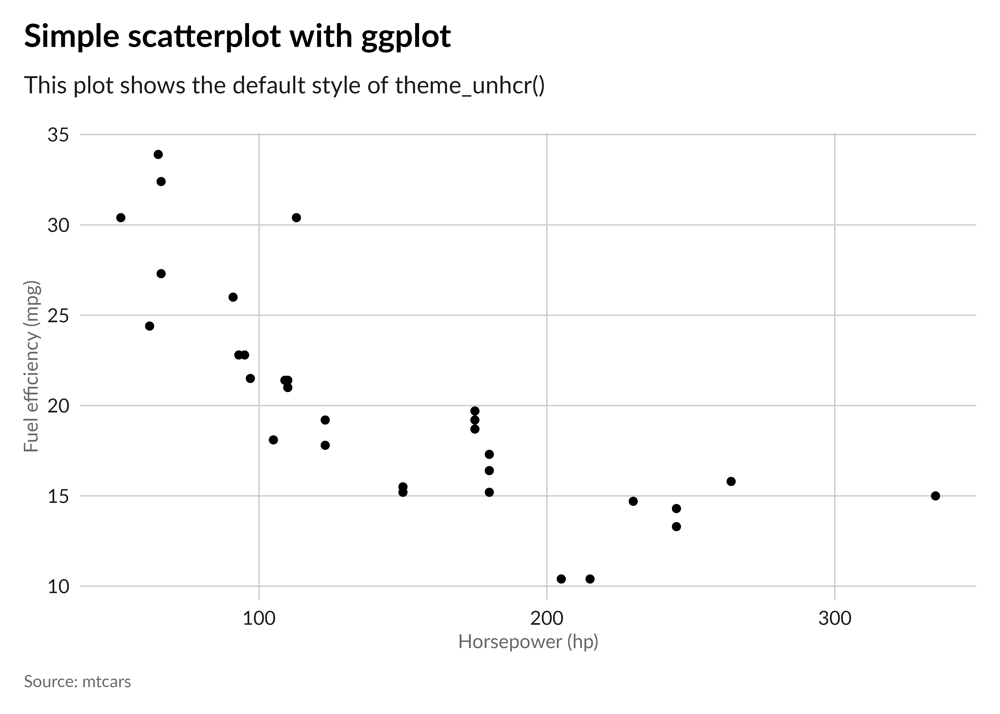
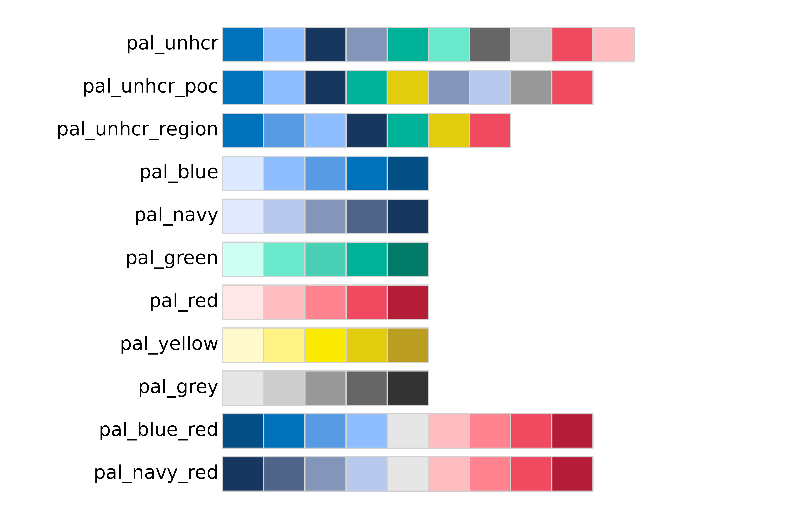
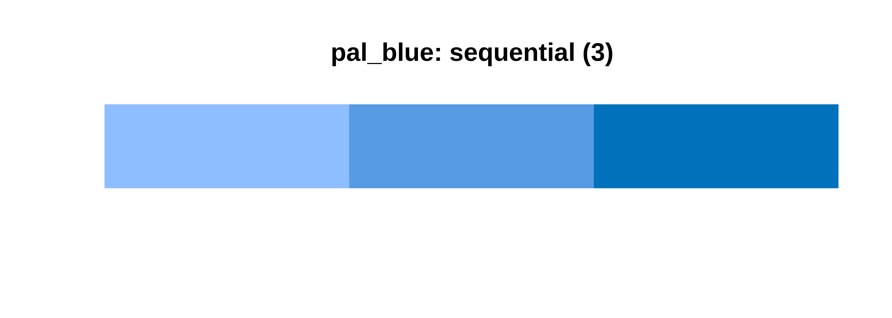
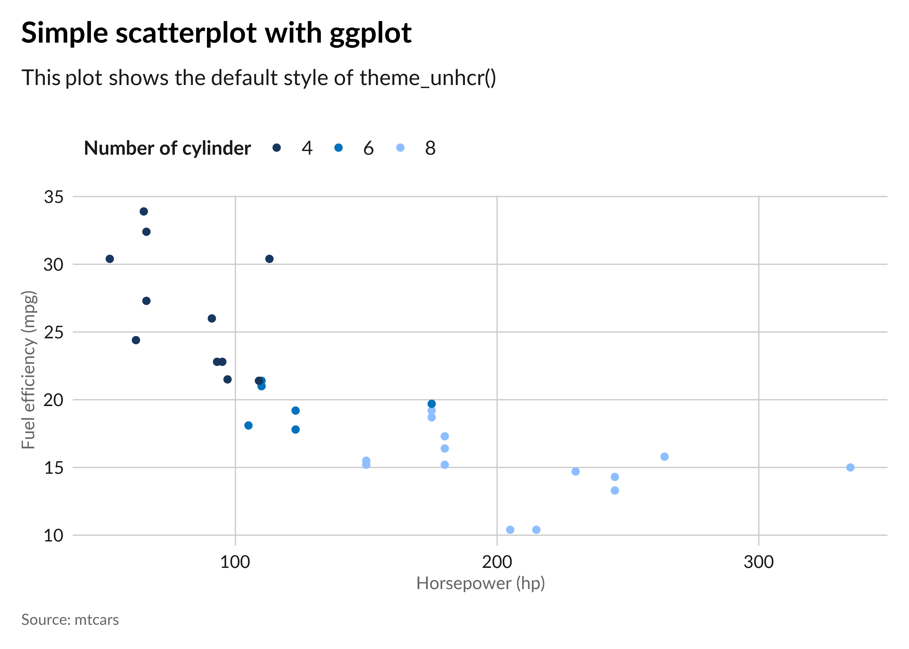
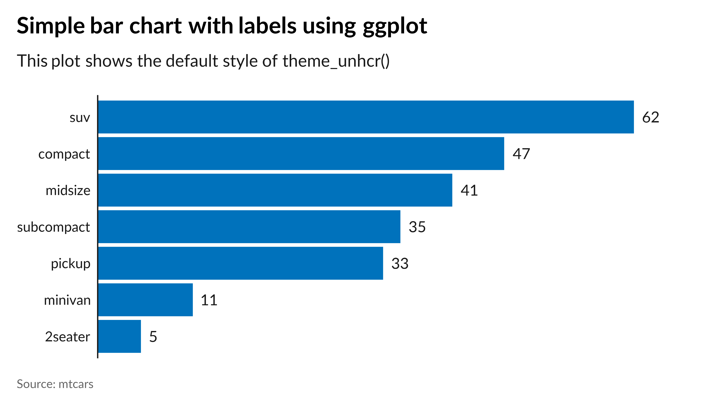

<!-- README.md is generated from README.Rmd. Please edit that file -->

# unhcrthemes 

<!-- badges: start -->

[](https://lifecycle.r-lib.org/articles/stages.html#stable)
[](https://github.com/unhcr-dataviz/unhcrthemes/actions/workflows/R-CMD-check.yaml)
[](https://CRAN.R-project.org/package=unhcrthemes)
<!-- badges: end -->

Simplify the creation of your data visualizations with the
`{unhcrthemes}` R package. It is designed to align your plots with
[UNHCR’s data visualization](https://dataviz.unhcr.org/guidance/)
recommendations. This package offers a comprehensive `{ggplot2}` theme,
including built-in customizations and thoughtfully crafted color
palettes.

## Features

- A consistent and appealing `{ggplot2}` theme that matches [UNHCR Data
  Visualization Guidelines](https://dataviz.unhcr.org/guidance/).
- A collection of color palettes ensuring your plots are consistent with
  [UNHCR’s color scheme](https://dataviz.unhcr.org/guidance/).
- Easy-to-use functions to apply the theme and color palettes to your
  `{ggplot2}` plots.

## Installation

Get started by installing the `{unhcrthemes}` package from CRAN with:

``` r
install.packages("unhcrthemes")
```

Or retrieve the development version from Github using the `{pak}`
package:

``` r
# If pak is not yet installed, uncomment the following line:
# install.packages("pak")

pak::pkg_install("unhcr-dataviz/unhcrthemes")
```

## Usage

``` r
# Load required packages
library(ggplot2)
library(unhcrthemes)
```

### Base `{ggplot2}` theme

``` r
# Apply the theme_unhcr() to your plot
ggplot(
  mtcars,
  aes(x = hp, y = mpg)
) +
  geom_point() +
  labs(
    title = "Simple scatterplot with ggplot",
    subtitle = "This plot shows the default style of theme_unhcr()",
    x = "Horsepower (hp)",
    y = "Fuel efficiency (mpg)",
    caption = "Source: mtcars"
  ) +
  theme_unhcr()
```



### Fonts

One of the two officially recommended fonts outlined in the [UNHCR Data
Visualization Guidelines](https://dataviz.unhcr.org/guidance/) is
[`Lato`](https://fonts.google.com/specimen/Lato). To ensure optimal
functionality of the `{unhcrthemes}` package, please make sure that the
`Lato` font is installed on your device prior to usage.

For `R` PDF (`pdf`) and PostScript (`postcript`) devices, there is a
function `import_lato` that can be used to import the `Lato` font into
these two devices. We recommend the use of `cairo_pdf` or `cairo_ps`
devices, which work when you have `Lato` installed. They are available
on all platforms and have better support custom fonts.

### Color palettes

Choose from a variety of carefully curated color palettes that harmonize
with UNHCR’s visual identity.

``` r
# Display all unhcr color palette
display_unhcr_all()
```



``` r
# Or select a specific one and limit the number of colors
display_unhcr_pal(n = 3, "pal_blue")
```



### Scales (color/fill)

``` r
# Add color scale to your plot
ggplot(
  mtcars,
  aes(x = hp, y = mpg, color = as.factor(cyl))
) +
  geom_point(alpha = .8) +
  labs(
    title = "Simple scatterplot with ggplot",
    subtitle = "This plot shows the default style of theme_unhcr()",
    x = "Horsepower (hp)",
    y = "Fuel efficiency (mpg)",
    color = "Number of cylinder",
    caption = "Source: mtcars"
  ) +
  scale_color_unhcr_d() +
  theme_unhcr(legend_title = TRUE)
```



### Geoms (text/label)

``` r
# Default Lato font also apply for geom_text and label
dplyr::count(mpg, class) |>
  dplyr::arrange(n) |>
  dplyr::mutate(class = factor(class, levels = class)) |>
  ggplot(aes(n, class)) +
  geom_col(fill = unhcr_pal(n = 1, "pal_blue")) +
  geom_text(aes(label = n), hjust = 0, nudge_x = 1) +
  labs(
    title = "Simple bar chart with labels using ggplot",
    subtitle = "This plot shows the default style of theme_unhcr()",
    caption = "Source: mtcars"
  ) +
  scale_x_continuous(expand = expansion(c(0, 0.1))) +
  theme_unhcr(grid = FALSE, axis = "y", axis_title = FALSE, axis_text = "y")
```



Explore more examples of `{unhcrthemes}` in action on the [package
vignette](https://unhcr-dataviz.github.io/unhcrthemes/articles/unhcrthemes.html)
or [UNHCR Data Visualization
Platform](https://dataviz.unhcr.org/tutorials/r/).

## Additional UNHCR Tools

<!-- * [**unhcrthemes**](https://github.com/unhcr-dataviz/unhcrthemes): UNHCR branded ggplot2 theme and color palettes -->

- [**unhcrdown**](https://github.com/unhcr-dataviz/unhcrdown): UNHCR
  templates for R Markdown
- [**refugees**](https://github.com/PopulationStatistics/refugees):
  Access to UNHCR Refugee Data Finder API
- [**quarto-html-unhcr**](https://github.com/unhcr-dataviz/quarto-html-unhcr):
  Quarto extension for UNHCR branded HTML documents
- [**quarto-revealjs-unhcr**](https://github.com/unhcr-dataviz/quarto-revealjs-unhcr):
  Quarto extension for UNHCR branded presentations
- [**Data Visualization Platform**](https://dataviz.unhcr.org/): UNHCR’s
  data visualization guidelines and tools

## Acknowledgements

We extend our gratitude to the creators of the
[`{hrbrthemes}`](https://github.com/hrbrmstr/hrbrthemes),
[`{rcartocolor}`](https://github.com/Nowosad/rcartocolor) and
[`{cowplot}`](https://github.com/wilkelab/cowplot/) packages that
influenced the development of `{unhcrthemes}`.

## Contribution and Code of Conduct

Contributions to `{unhcrthemes}` are highly valued. To ensure a
welcoming and inclusive community, we follow our [Contributor Code of
Conduct](https://contributor-covenant.org/version/2/0/CODE_OF_CONDUCT.html).
If you have suggestions, uncover bugs, or envision new features, kindly
submit an [issue on
GitHub](https://github.com/unhcr-dataviz/unhcrthemes/issues). To
contribute code, don’t hesitate to fork the repository and create a pull
request.

## License

This package is distributed under the [MIT
License](https://github.com/unhcr-dataviz/unhcrthemes/blob/master/LICENSE.md).
