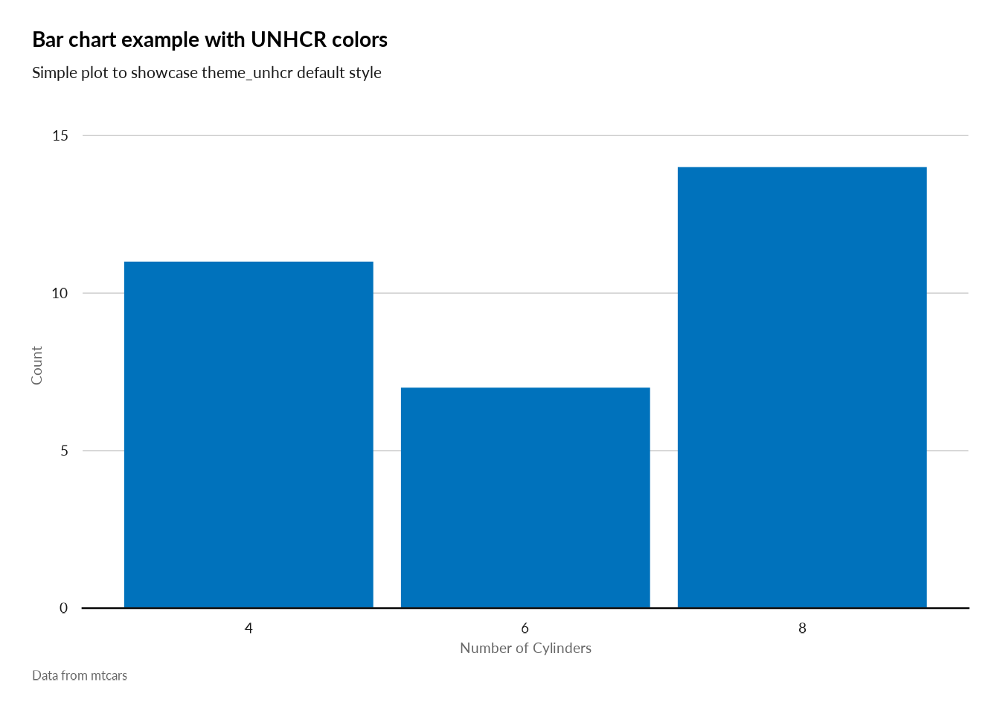

<!-- README.md is generated from README.Rmd. Please edit that file -->

# unhcrthemes <a href="https://github.com/vidonne/unhcrthemes"></a>

<!-- badges: start -->

[](https://www.repostatus.org/#wip)
[](https://github.com/vidonne/unhcrthemes/actions)
[](https://CRAN.R-project.org/package=unhcrthemes)
<!-- badges: end -->

## Overview

The **unhcrthemes** package provides a `ggplot2` theme and a set of
colour palettes for making charts and graphics based on [UNHCR Data
Visualization
Guidelines](https://www.unhcr.org/brand/wp-content/uploads/sites/89/2021/11/UNHCR_Data_Visualization_Guidelines.pdf).
The goal of this package is to ease and speed up the creation of charts,
while promoting the UNHCR visual identity with a predefined `ggplot`
theme, as well as a set of colour palettes and scales.

## Installation

This package is not on yet on CRAN and to install it, you will need the
remotes package.

``` r
install.packages("remotes")
remotes::install_github("vidonne/unhcrthemes")
```

## Content

A package with all necessary elements to quickly implement [UNHCR Brand
style](https://www.unhcr.org/brand/how-we-look/) in your statistical
products and data stories:

1.  Adjusted `ggplot2` theme
2.  A series of color palette for:
    -   A **categorical palette** for UNHCR main data visualization
        colors
    -   A **categorical palette** for people of concern to UNHCR
        categories
    -   A **categorical palette** for geographical regional divisions of
        UNHCR
    -   Six **sequential color palettes** for all the main data
        visualization colors
    -   Two recommended **diverging color palette**

## Fonts

UNHCR uses **Lato** as its main font for publications and data
visualizations. **Arial** can also be used as a fallback option if it is
not possible to install **Lato** on your computer.

## Usage

``` r
library(tidyverse)
library(scales)
library(unhcrthemes)
library(unhcrdatapackage) ## remotes::install_github("unhcr/unhcrdatapackage")
```

### Base ggplot2 theme

``` r
pop_total <- unhcrdatapackage::demographics |>
  filter(Population.type == "IDP", Year >= 2010) |>
  group_by(year = Year) |>
  summarise(idp = sum(Total, na.rm = TRUE) / 1e6) |>
  ungroup()


glimpse(pop_total)
#> Rows: 11
#> Columns: 2
#> $ year <dbl> 2010, 2011, 2012, 2013, 2014, 2015, 2016, 2017, 2018, 2019, 2020
#> $ idp  <dbl> 14.69780, 15.47338, 17.67037, 23.92555, 32.27462, 37.49417, 36.62~
```

``` r
ggplot(pop_total) +
  geom_col(aes(x = year, y = idp),
           width = 0.8) +
  labs(title = "Globalement IDP displacement | 2010 - 2020",
       subtitle = "Number of people (in million)",
       x = "",
       y = "",
       caption = "Source: UNHCR Refugee Data Finder\n© UNHCR, The UN Refugee Agency") +
  scale_y_continuous(expand = expansion(c(0, 0.1))) +
  scale_x_continuous(breaks = pretty_breaks(10)) +
  theme_unhcr(grid = "Y")
```


### UNHCR color palette

All recommended data visualization colors are accessible as **palettes**
or **scales** (color/fill).

``` r
display_unhcr_all()
```


### Base theme and color scale

``` r
ggplot(pop_total) +
  geom_col(aes(x = year, y = idp),
           fill = unhcr_pal(n = 1, "pal_blue"),
           width = 0.8) +
  labs(title = "Globalement IDP displacement | 2010 - 2020",
       subtitle = "Number of people (in million)",
       x = "",
       y = "",
       caption = "Source: UNHCR Refugee Data Finder\n© UNHCR, The UN Refugee Agency") +
  scale_y_continuous(expand = expansion(c(0, 0.1))) +
  scale_x_continuous(breaks = pretty_breaks(10)) +
  theme_unhcr(grid = "Y")
```



``` r
pop_total_sex <- demographics |>
  filter(Population.type == "IDP", Year >= 2010) |>
  select(year = Year, female = FemaleTotal, male = MaleTotal) |>
  pivot_longer(cols = -year, names_to = "sex",
               values_to = "idp") |>
  group_by(year, sex) |>
  summarise(idp = sum(idp, na.rm = TRUE) / 1e6) |>
  ungroup()
#> `summarise()` has grouped output by 'year'. You can override using the `.groups` argument.

glimpse(pop_total_sex)
#> Rows: 22
#> Columns: 3
#> $ year <dbl> 2010, 2010, 2011, 2011, 2012, 2012, 2013, 2013, 2014, 2014, 2015,~
#> $ sex  <chr> "female", "male", "female", "male", "female", "male", "female", "~
#> $ idp  <dbl> 5.158210, 5.170928, 5.874562, 5.753568, 5.389737, 5.375677, 6.938~
```

``` r
ggplot(pop_total_sex) +
  geom_col(aes(x = year, y = idp, fill = sex),
           width = 0.8,
           position = position_dodge(width = 0.9)) +
  scale_fill_unhcr_d(palette = "pal_unhcr") +
  scale_y_continuous(expand = expansion(c(0, 0.1))) +
  labs(title = "Globalement IDP displacement | 2010 - 2020",
       subtitle = "Number of people (in million)",
       x = "",
       y = "",
       caption = "Source: UNHCR Refugee Data Finder\n© UNHCR, The UN Refugee Agency") +
  scale_x_continuous(breaks = pretty_breaks(10)) +
  theme_unhcr(grid = "Y")
```


## UNHCR packages

unhcrthemes is part of **unhcrverse**, a set of packages to ease the
production of statistical evidence and data stories.

-   [unhcrdown](https://github.com/vidonne/unhcrdown): UNHCR templates
    for R Markdown
-   [unhcrdatapackage](https://github.com/Edouard-Legoupil/unhcrdatapackage):
    Use UNHCR Open data
-   [hcrdata](https://github.com/UNHCR-WEB/hcrdata/): API to connect to
    internal data source
-   [HighFrequencyChecks](https://github.com/unhcr/HighFrequencyChecks/):
    Perform High Frequency Check
-   [koboloadeR](https://github.com/unhcr/koboloadeR/): Process data
    crunching for survey dataset

You can install them all with the following:

``` r
## unhcrdown
remotes::install_github("vidonne/unhcrdown")
## unhcrdatapackage
remotes::install_github('unhcr/unhcrdatapackage')
## hcrdata
remotes::install_github('unhcr-web/hcrdata')
## HighFrequencyChecks
remotes::install_github('unhcr/HighFrequencyChecks')
## koboloadeR
remotes::install_github('unhcr/koboloadeR')
```

## Getting help

Please report any issues or bugs on
[GitHub](https://github.com/vidonne/unhcrthemes/issues), try to include
a minimal reproducible example to help us understand.

## Code of Conduct

Please note that the mynewpack project is released with a [Contributor
Code of
Conduct](https://contributor-covenant.org/version/2/0/CODE_OF_CONDUCT.html).
By contributing to this project, you agree to abide by its terms.
