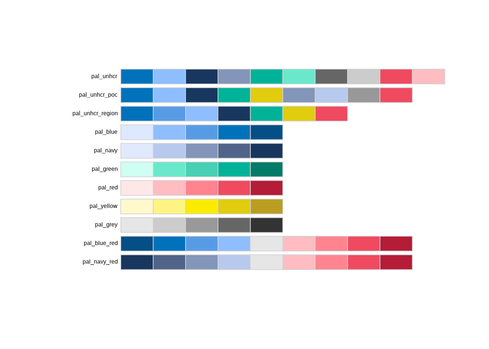
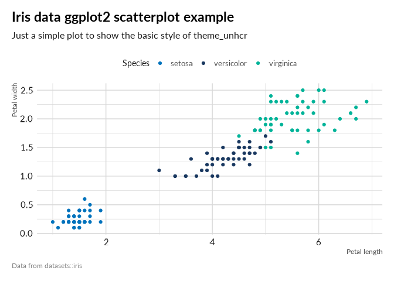

<!-- README.md is generated from README.Rmd. Please edit that file -->

# unhcrthemes

<!-- badges: start -->

[](https://github.com/vidonne/unhcrthemes/actions)
<!-- badges: end -->

The **unhcrthemes** package provides a theme and a set of colour
palettes for plots based on [UNHCR Data Visualization
Guidelines](https://www.unhcr.org/brand). The goal of this package is to
ease and speed up the creation of charts, while promoting the UNHCR
visual identity with a predefined ggplot theme, as well as a set of
colour palettes and scales.

## Installation

This package is not on yet on CRAN and to install it, you will need the
remotes package.

``` r
# install.packages("remotes")
remotes::install_github("vidonne/unhcrthemes")
```

## Content

A package with all necessary elements to quickly implement UNHCR Brand
style in your statistical products and data stories:

1.  Adjusted `ggplot2` theme
2.  A series of color palette for:
    -   **WIP** Discrete palette with either fixed or dynamically
        extended number of shades
    -   **WIP** Continuous diverging color palette
    -   **WIP** Continuous color palette

## Usage

First make sure to have all your fonts - and specifically **Lato** -
registered with R

``` r
library(unhcrthemes)
library(ggplot2)

# install.packages('showtext', dependencies = TRUE)
library(showtext)

# Check the current search path for fonts
allfontpath <- font_paths()

# syntax: font_add(family = "<family_name>", regular = "/path/to/font/file")
font_add("Lato", regular = "Lato-Regular.ttf",  bold = "Lato-Bold.ttf", italic = "Lato-Italic.ttf")

# automatically use showtexts for new devices
showtext::showtext_auto()
```

### UNHCR color palette

``` r
display_unhcr_all()
```

<!-- -->

### Base ggplot2 theme

``` r
library(ggplot2)
ggplot(datasets::iris, aes(x = Petal.Length, y = Petal.Width)) +
  geom_point() +
  labs(x = "Petal length", y="Petal width",
      title = "Iris data ggplot2 scatterplot example",
      subtitle = "Just a simple plot to show the basic style of theme_unhcr",
      caption = "Data from datasets::iris") +
  theme_unhcr()
```

<!-- -->

### Base ggplot2 theme + color scale

``` r
ggplot(datasets::iris, aes(x = Petal.Length, y = Petal.Width)) +
  geom_point(aes(color = Species)) +
  scale_color_unhcr_d(palette = "pal_unhcr") +
  labs(x = "Petal length", y="Petal width",
      title = "Iris data ggplot2 scatterplot example",
      subtitle = "Just a simple plot to show the basic style of theme_unhcr",
      caption = "Data from datasets::iris") +
  theme_unhcr()
```

<!-- -->

## UNHCR packages

unhcrthemes is part of **unhcrverse**, a set of packages to ease the
production of statistical evidence and data stories.

-   [unhcrdown](https://github.com/vidonne/unhcrdown): UNHCR templates
    for R Markdown
-   [unhcrdatapackage](https://github.com/Edouard-Legoupil/unhcrdatapackage):
    Use UNHCR Open data
-   [hcrdata](https://github.com/UNHCR-WEB/hcrdata/): API to connect to
    internal data source
-   [HighFrequencyChecks](https://github.com/unhcr/HighFrequencyChecks/):
    Perform High Frequency Check
-   [koboloadeR](https://github.com/unhcr/koboloadeR/): Process data
    crunching for survey dataset

You can install them all with the following:

``` r
## unhcrdown
remotes::install_github("vidonne/unhcrdown")
## unhcrdatapackage
remotes::install_github('unhcr/unhcrdatapackage')
## hcrdata
remotes::install_github('unhcr-web/hcrdata')
## HighFrequencyChecks
remotes::install_github('unhcr/HighFrequencyChecks')
## koboloadeR
remotes::install_github('unhcr/koboloadeR')
```
